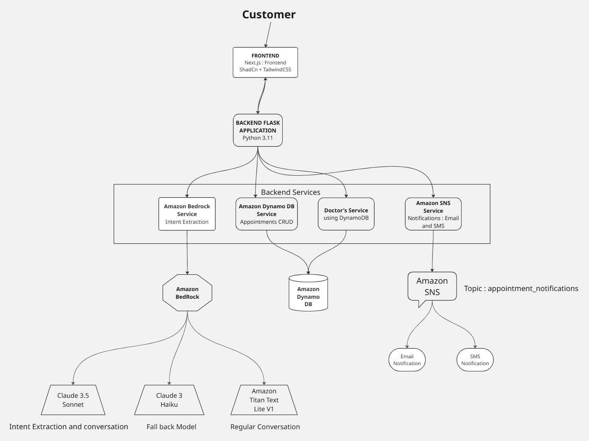

# 🌅 Sunrise Medical AI Appointment Assistant

An AI-powered healthcare web application that helps patients **book, cancel, or check doctor appointments** through natural conversation.  
Built for the **AWS AI Agent Global Hackathon 2025**.

---

## 🧭 Overview

**Sunrise Medical Center’s AI Appointment Assistant** combines conversational AI with real-time hospital scheduling to deliver an accessible digital healthcare experience.  
Patients can chat naturally to schedule appointments, view available doctors, and receive SMS / email notifications for confirmations and reminders.

---

## 🏗️ Architecture

```
🌐 Next.js (ShadCN UI)  →  Flask Backend (API)
                                   │
                                   ▼
                       🤖 Amazon Bedrock (Claude 3.5 / Haiku / Titan)
                                   │
                 ┌─────────────────┴─────────────────┐
                 ▼                                   ▼
         🗃️ DynamoDB (Tables: Doctors, Appointments)   🔔 SNS (Email + SMS)
                                   │
                                   ▼
                     ⏰ EventBridge + Lambda (Reminders)
```

---

## ⚙️ Tech Stack

| Layer | Technology / Service | Purpose |
|-------|----------------------|----------|
| **Frontend** | **Next.js 14**, ShadCN UI, Tailwind CSS | Web portal (Home / Doctors / Chat pages) |
| **Backend** | **Flask (Python 3.10)** | REST API & AWS integration |
| **AI Model** | **Amazon Bedrock (Claude 3.5 Sonnet, Haiku, Titan Text)** | Intent extraction + conversation |
| **Database** | **Amazon DynamoDB** | Stores doctor and appointment records |
| **Notifications** | **Amazon SNS** | Sends appointment confirmations via email & SMS |
| **Scheduling** | **Amazon EventBridge + Lambda** | Sends reminder notifications |
| **Security / Config** | **IAM Roles**, AWS Secrets Manager / .env | Secure credential management |
| **Hosting (optional)** | **EC2 / Elastic Beanstalk / Amplify** | Backend & frontend deployment |

---

## 🚀 Features

✅ Conversational AI Chat (Amazon Bedrock)  
✅ Doctor Directory (DynamoDB)  
✅ One-click Appointment Booking  
✅ SMS + Email Alerts (Amazon SNS)  
✅ Automated Reminders (EventBridge + Lambda)  
✅ Accessible Design (voice assist ready)  
✅ Scalable & Serverless AWS Architecture

---

## 🩺 API Endpoints (Flask Backend)

| Endpoint | Method | Description |
|-----------|---------|-------------|
| `/` | GET | Health check |
| `/doctors` | GET | List all doctors from DynamoDB |
| `/doctors/<doctor_id>` | GET | Get specific doctor details |
| `/chat` | POST | Conversational AI for book/cancel/check |
| `/aws-test` | GET | Verify AWS STS connection |

---

## 💬 Chat Intent Examples

| User Message | AI Extracted Intent (JSON) |
|---------------|----------------------------|
| “Book appointment with Dr. Emily Carter tomorrow at 10 AM” | `{"intent":"book_appointment","doctor":"Dr. Emily Carter","date":"2025-10-20","time":"10:00 AM"}` |
| “Cancel my appointment for today” | `{"intent":"cancel_appointment","appointment_id":"…"}` |
| “Hi there!” | `{"intent":"conversation","reply":"Hello! How can I help you today?"}` |

---

## 🧠 AWS AI Model Strategy

| Priority | Model | Use Case |
|-----------|--------|----------|
| 1️⃣ | **Claude 3.5 Sonnet** | Primary intent extraction |
| 2️⃣ | **Claude 3 Haiku** | Lightweight fallback |
| 3️⃣ | **Titan Text Lite v1** | Conversational fallback (chat mode) |

---

## 🔔 Notification Flow (SNS)

1. Appointment confirmed → Flask calls `send_email_notification()` and `send_sms_notification()`  
2. SNS Topic (`appointment_notifications`) broadcasts email to subscribers  
3. Direct SMS sent to verified patient number  
4. EventBridge + Lambda can trigger reminders 24 h or 2 h before appointments

---

## 🧾 DynamoDB Schema

### **Doctors Table**

| Attribute | Type | Example |
|------------|------|---------|
| doctor_id | String | D-101 |
| doctor_name | String | Dr. Emily Carter |
| specialization | String | Cardiology |
| hospital_name | String | Sunrise Medical Center |
| room_number | String | Room 201 |
| contact_number | String | +1-555-120-4567 |
| email | String | emily.carter@sunrisemed.org |

### **Appointments Table**

| Attribute | Type | Example |
|------------|------|---------|
| appointment_id | String | UUID |
| user_id | String | guest |
| doctor_name | String | Dr. Emily Carter |
| date | String | 2025-10-20 |
| time | String | 10:00 AM |
| status | String | BOOKED |

---

## ⚙️ Local Setup

### 1️⃣ Clone the Repository
```bash
git clone https://github.com/<your-username>/sunrise-medical-assistant.git
cd sunrise-medical-assistant
```

### 2️⃣ Backend Setup
```bash
cd healthcare_assistant_backend
python3 -m venv venv
source venv/bin/activate
pip install -r requirements.txt
```

Create `.env`:
```
AWS_REGION=us-east-1
DOCTORS_TABLE=Doctors
APPOINTMENTS_TABLE=Appointments
SNS_TOPIC_ARN=arn:aws:sns:us-east-1:123456789012:appointment_notifications
SMS_RECEIVER_NUMBER=+15551234567
```

Run Flask:
```bash
python app.py
```

### 3️⃣ Frontend Setup
```bash
cd healthcare-portal
npm install
npm run dev
```
Visit → `http://localhost:3000`

---

## 🧩 Directory Structure

```
healthcare_assistant_backend/
│
├── app.py                        # Flask main entry
├── services/
│   ├── bedrock_service.py        # Bedrock intent & conversation
│   ├── doctors_service.py        # DynamoDB Doctors CRUD
│   ├── dynamodb_service.py       # Appointments book/cancel/list
│   ├── sns_service.py            # SNS email/SMS notifications
│
└── requirements.txt

healthcare-portal/                # Next.js Frontend
│
├── src/app/
│   ├── page.tsx                  # Home Page
│   ├── doctors/page.tsx          # View Doctors
│   ├── chat/page.tsx             # Chat Assistant
│
└── components/
    ├── DoctorCard.tsx
    └── ui/ (button, card, etc.)
```

---

## 👥 Team Contributions

### 🧑‍💻 Sai Aditya Urumu  
**Role:** Project Lead & Full-Stack AI Engineer  
- Designed and implemented the end-to-end AI workflow using **Amazon Bedrock** (Claude 3.5 Sonnet, Haiku, and Titan Text).  
- Developed the **Flask backend services** integrating DynamoDB and SNS.  
- Architected and configured the **AWS infrastructure** (IAM, SNS topics, DynamoDB schema, environment setup).  
- Built the **Next.js frontend** using **ShadCN UI**, Tailwind CSS, and API integration for doctor listing and chatbot interaction.  
- Created the **AI intent router**, multi-model fallback logic, and DynamoDB-based booking system.  
- Led **project deployment, architecture design, and documentation** for hackathon submission.

---

### 👩‍💻 Monika  
**Role:** Data & Accessibility Engineer  
- Designed and populated the **Doctors and Appointments datasets** in DynamoDB.  
- Developed **data consistency workflows** for doctor availability and appointment synchronization.  
- Focused on **user accessibility features**, ensuring inclusive UI/UX design.  
- Contributed to **frontend user flow** for viewing doctor profiles and booking appointments.  
- Assisted in **testing the Bedrock model outputs** for accuracy and tone consistency.  
- Co-authored documentation and **AWS architecture diagram** for final presentation.

---

> Together, the team combined AI reasoning, AWS integration, and user-centric design to deliver an **Accessible AI Appointment Assistant** for Sunrise Medical Center.

---

## 🧠 Future Enhancements

- 🗣️ Voice input/output (Amazon Polly + Transcribe)  
- 🌍 Multi-language translation (Amazon Translate)  
- 📅 Analytics Dashboard (Amazon QuickSight)  
- 🔐 User Authentication (Amazon Cognito)  
- ☁️ Serverless deployment (AWS Lambda + API Gateway)

---

## 🏆 Hackathon Highlights

- **Category:** Accessible Help Companion / Healthcare AI  
- **Team:** Sai Aditya Urumu & Monika  
- **LLM:** Amazon Bedrock Claude 3.5 Sonnet with multi-model fallbacks  
- **Budget Control:** $100 AWS Credit limit policy  
- **Demo Goal:** Accessible AI appointment service with voice and language support

---

## 📄 License
This project is licensed under the **MIT License** — feel free to use, modify, and build upon it.

---

### 💛 Acknowledgements
Built for the **AWS AI Agent Global Hackathon 2025**.  
Thanks to **Amazon Bedrock**, **DynamoDB**, and **SNS** for powering this accessible AI healthcare experience.

---

## 🖼️ Architecture Diagram

```markdown

```
